# 3 užduotis

# Diegimo failo naudojimo instrukcija

Paspaudus ant *Student_grading_setup.exe* failo, pasirinkite, kur išsaugoti programą. Rekomenduojama pasirinkti laukelyje nurodytą diegimo vietą.  
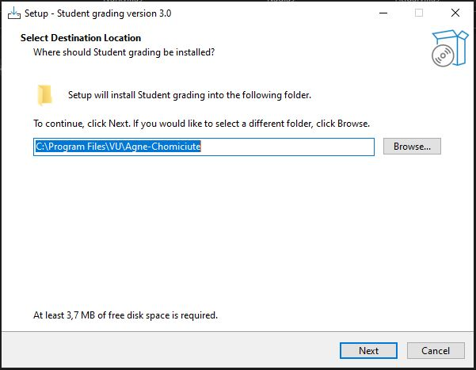  

Pasirinkite sukurti darbalaukio nuorodą į programą. Paspauskite „Next“.  
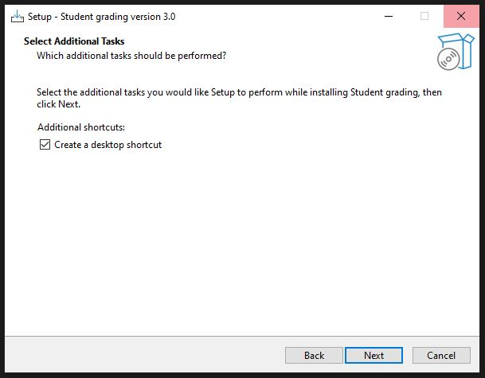  

Paspauskite „Install“.  
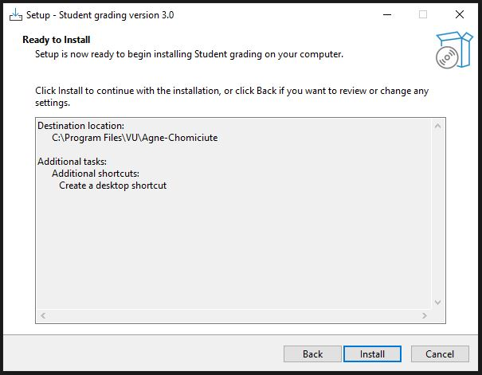  

Pasirinkite iš karto paleisti programą arba tieisog uždarykite langą.  
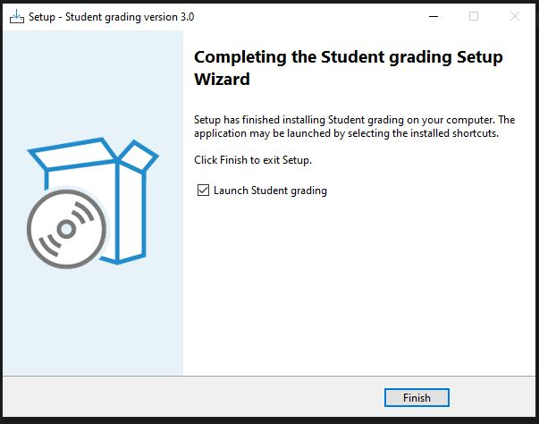  

Pasirinkus iš karto paleisit programą, jums atsidarys programos meniu.  
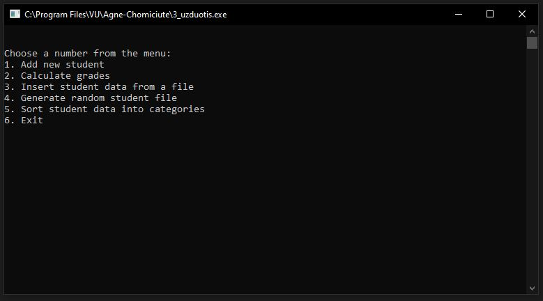  

Darbalaukyje turėtų atsirasti nuoroda į programą. Taip pat ją galima paleisti iš „Start“ meniu.  
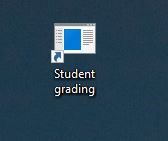  

Norint pašalinti programą, tai galite padaryti per „Valdymo skydą“ → „Programos“ → „Pašalinti programą“.  
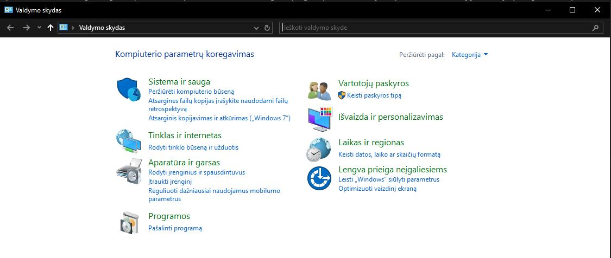  

Programų sąraše radę programą, ją galite pašalinti paspaudę dešinįjį kompiuterio pelės klavišą ir pasirinkę „Pašalinti“.  
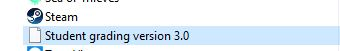  
  

# Programos naudojimosi instrukcija

Paleidus programą rodomas pasirikimų meniu:  
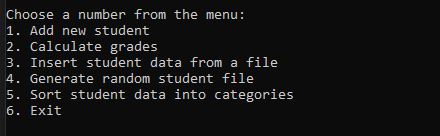  

## Studentų duomenų įvestis  

### Duomenų įvedimas rankiniu būdu
Įveskite ***skaičių 1***, kad suvesti studentų duomenis ***rankiniu būdų***.  
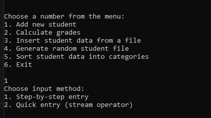  
  
Toliau, galima pasirinkti įvesti duomenis paeiliui (***1***), kur programa pati paprašo studento vardo, pavardės ir t.t., arba duomenis surašyti į vieną eilutę (***2***).  

Pasirinkus ***1. `Step-by-step entry`***, duomenys turi būti suvesti tokiu formatu:  
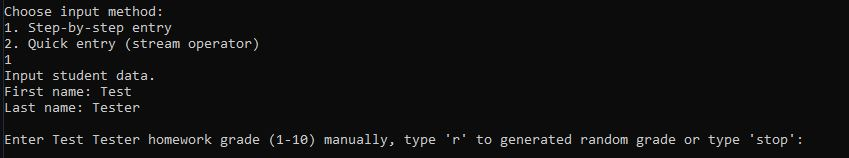  
Balus reikia įvesti po vieną. Galima atsitiktinai sugeneruoti balą parašius '***r***'.  

Pasirinkus ***2. `Quick entry`***, duomenys turi būti suvesti tokiu formatu:  
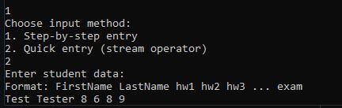  

Galutinė išvestis atodo taip:  
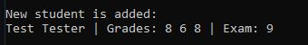  

### Duomenų įvedimas iš failo
Įveskite ***skaičių 3***, kad duomenis programa nuskaitytų iš failo.  
Įveskite pilną failo pavadinimą pvz.: Student1000.txt   
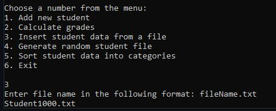  

Pranešimas, kad duomenys nuskaityti sėkmingai:  
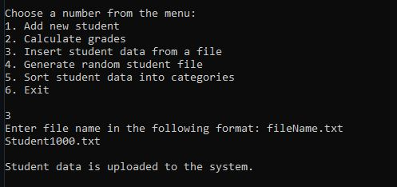  
  

### Atsitiktinių duomenų sąrašo generavimas
Programa leidžia sugeneruoti atsitiktinius duomenis ir su jais dirbti.  
Įveskite ***skaičių 4*** ir kiek eilučių norite, kad programa sugeneruotų.  
Programa praneš, jei failas sėkmingai sugeneruotas.  
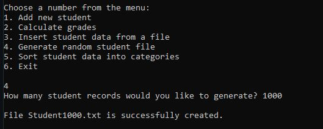  

## Darbas su duomenimis

### Apskaičiuoti galutinį balą
Įveskite ***skaičių 2***, kad apskaičiuoti galutinį balą.  
Pasirinkite, ar skaičiuoti galutinį balą su vidurkiu '***m***', mediana '***md***', ar gauti abu rezultatus '***b***'.  
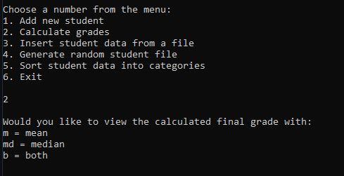  

Išvestis gaunama ekrane:  
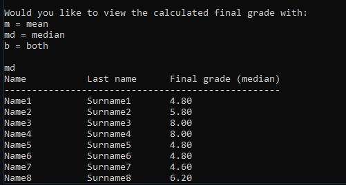  

### Surušiuoti studentus į dvi kategorijas
Programa leidžia studentus surūšiuoti i dvi kategorijas: "vargšiukus" (strugglers) ir "kietiakus" (high achievers).  
Įveskite ***skaičių 5*** ir pateikite failo, iš kurio nuskaityti duomenis, pavadinimą (pvz. Student1000.txt).  
  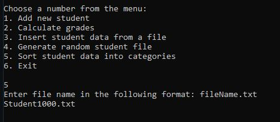  
  
Pasirinkite kaip papildomai surūšiuoti sąrašą: pagal vardą '***n***' arba balus '***g***'.     
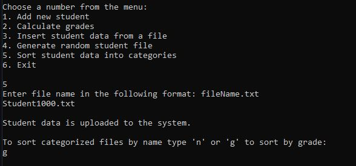  

Sėkmingai surušiavus duomenis, programa praneša apie išvestus failus.  
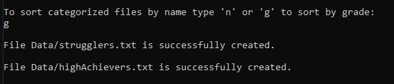

Išvestis failuose:  
***strugglers.txt*** ir ***highAchievers.txt*** failus galite rasti "C:/Program files/VU/Vardenis-Pavardenis"  
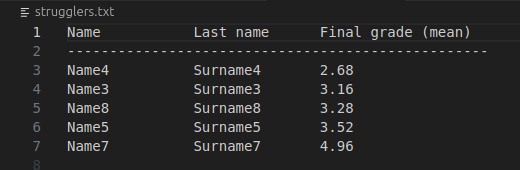  

## Baigti darbą
Įveskite ***skaičių 6***, kad baigtumėte darbą.

